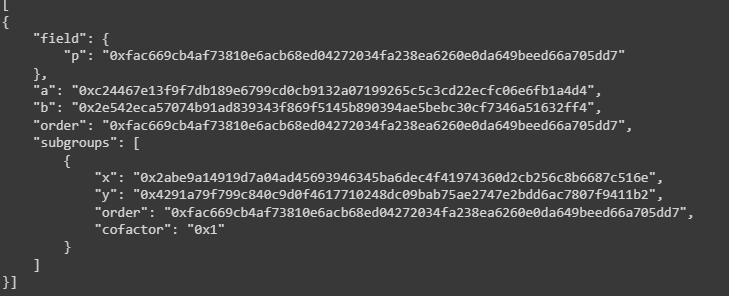

# Elliptic 160-bit

Đây là source code xây dựng đường cong elliptic 160 bit, có thể lên đến 256 bit.

### Cách dùng: 
- Mở đường link này: [Google Colab](https://colab.research.google.com/drive/1yTstzdR3_2CApHZgUjKcLCHSu7lpGEVv?usp=sharing)
- Chọn Runtime -> Run all

## Thông tin sinh viên
- Đỗ Tuấn Nghĩa - MSV: 21020365
- Lớp học phần: INT3213 1